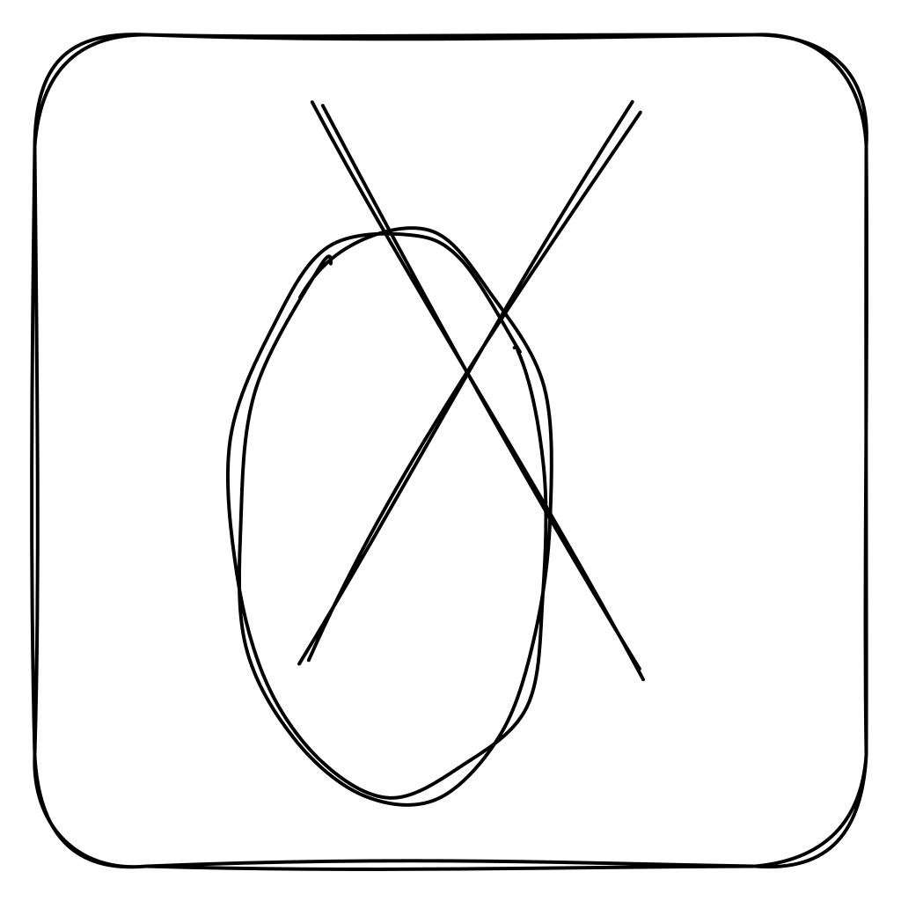
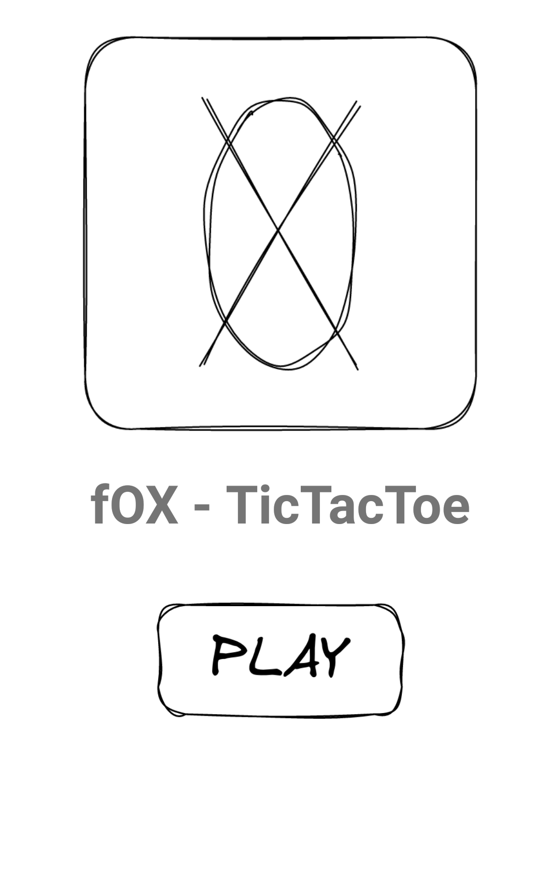
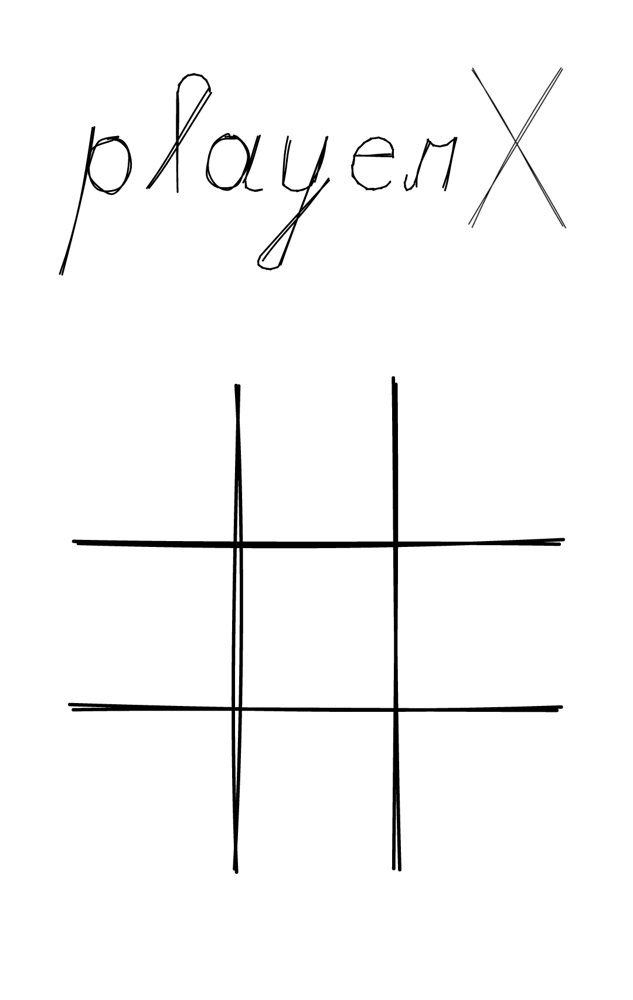
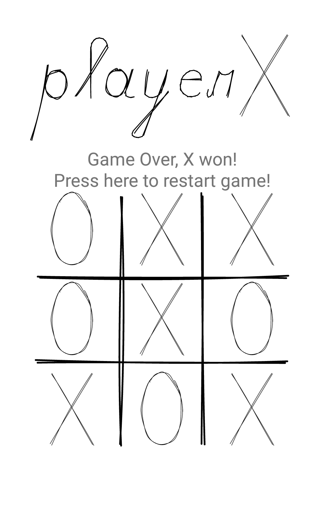
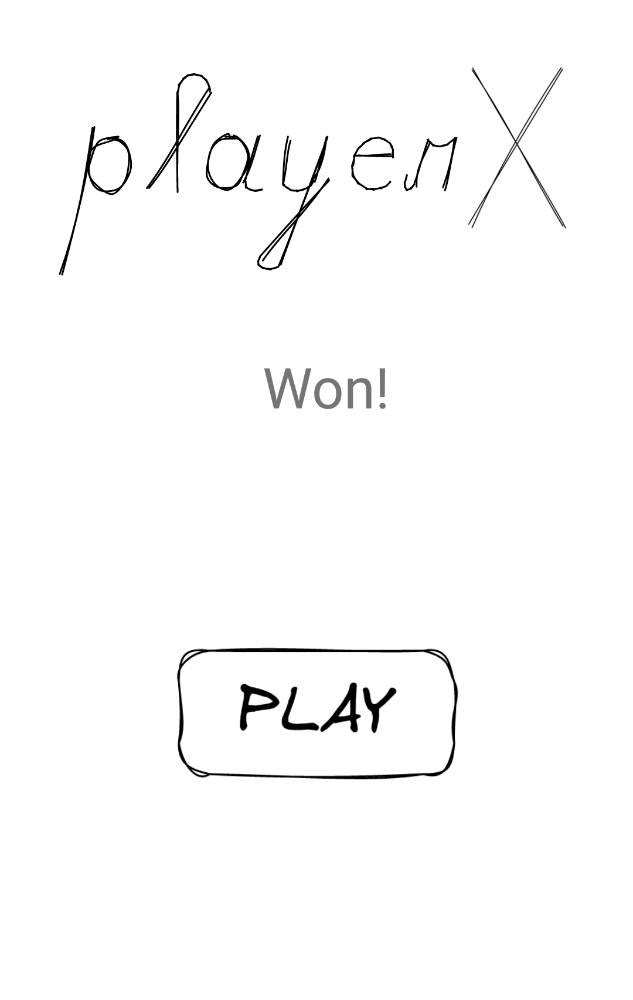
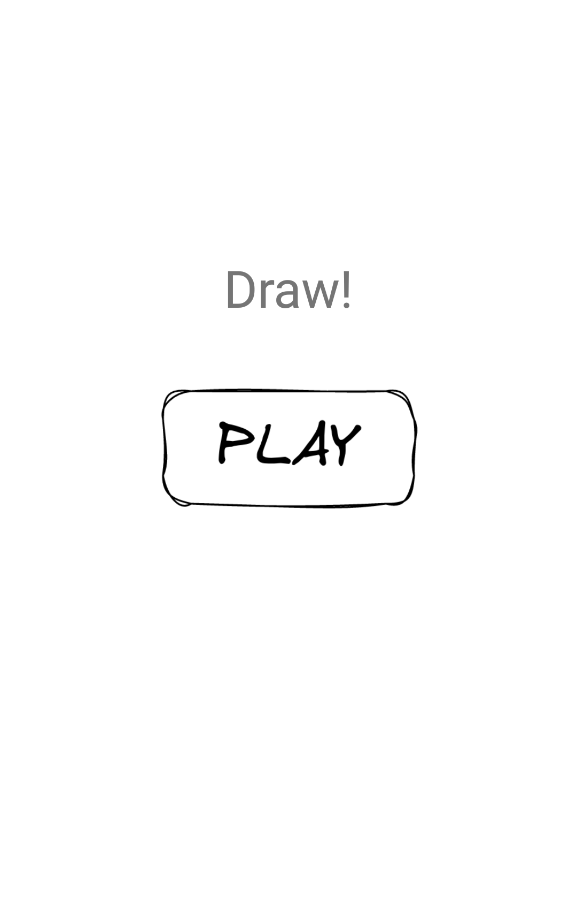

    

# fOX - TicTacToe

A minimally functioning TicTacToe Android application!

This app is made for learning purposes only and shouldn't be taken as ground truth for best development practices.

## fOX v1 - core application

[Commit 96690](https://github.com/simplicity-load/fOX/tree/9669077e547074db5b34dfe1ea493071a7eb3fcc)

The TicTacToe logic and the UI that supports the full extent of the game. 

This includes the TicTacToe class, the MainActivity class and the main layout file.

## fOX v1.1 - fragments and navigation

[Commit c2d8b](https://github.com/simplicity-load/fOX/tree/c2d8b4a4370c5e7563c8a40fda5df6840872459c)

This update splits the main activity into fragments and enables navigation between two fragments, the Start screen and the Game screen.

### Screenshots 

## fOX v1.2 - safeArgs

[Commit latest](https://github.com/simplicity-load/fOX)

Added two fragments (GameDrawFragments and GameWonFragment) and sent safe arguments to one of them.

### Screenshots 

# Licensing

## Source Code

Copyright (C) 2022 simplicity-load

This program is free software: you can redistribute it and/or modify it under the terms of the GNU Affero General Public License as published by the Free Software Foundation, either version 3 of the License, or (at your option) any later version.

This program is distributed in the hope that it will be useful, but WITHOUT ANY WARRANTY; without even the implied warranty of MERCHANTABILITY or FITNESS FOR A PARTICULAR PURPOSE. See the GNU Affero General Public License for more details.

You should have received a copy of the GNU Affero General Public License along with this program. If not, see https://www.gnu.org/licenses/.

## Images and Graphics

[Creative Commons Attribution 4.0 International (CC BY-NC-SA 4.0)](https://creativecommons.org/licenses/by-nc-sa/4.0/).
